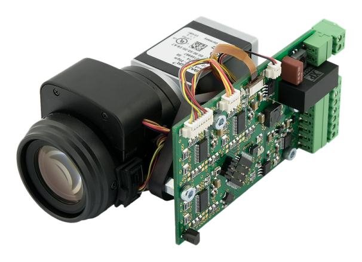
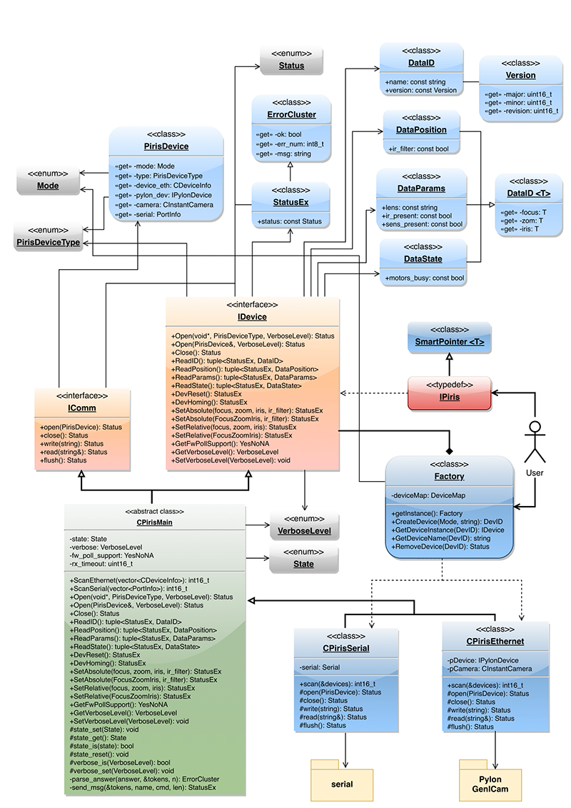

# ATEsystem s.r.o. PIRIS Controller C++ driver SDK
ATEsystem.PIRIS-driver is part of software support for P-IRIS Controller product. It serves as a main interface between the hardware and the control application. The driver allows complete control of the controller unit in both **UART/Ethernet** and **RS232** version. It implements a proprietary ATEsystem communication protocol which is described in the datasheet of the controller.  
EN: https://www.atesystem.cz/en/product/p-iris-controller-control-unit-for-lenses-with-stepper-motor  
CZ: https://www.atesystem.cz/produkt/p-iris-controller-ridici-jednotka-k-objektivum-s-krokovymi-motorky 



The driver is written in C++ 17 and is distributed in the form of source code under MIT licence. The software requires following dependencies: 
```
Pylon 5.0.12
VC++ Redistributable 2013 and 2017 (Windows only) 
Windows 10 SDK - 10.0.15063.0 (Windows only) 
```
https://www.baslerweb.com/en/sales-support/downloads/software-downloads/pylon-5-0-12-windows/  
https://support.microsoft.com/en-us/help/2977003/the-latest-supported-visual-c-downloads

The driver uses Serial open-source software. The dependencies are distributed in two folders, bin and install, and are necessary for proper function. The driver (including its dependencies) is multi-platform. The distribution includes executable examples for both **Windows OS (x86, amd64)** and **Linux OS (x86, amd64, armhf, arm64)**.  The SDK has been developed in Microsoft Visual Studio 2017 IDE which allows multi-platform development of C++ applications. IDE settings and further details can be found below.
### Installation
Upon extraction of the distributed archive open the Solution in Visual Studio 2017 using the included SLN file. **Linux** and **WinNT** folders include VS projects with corresponding settings of compiler and linker, separately for x86, amd64, armhf and arm64 architectures. **Shared** folder is the main container which includes the source code of the driver, header files, libraries and examples. **Bin** folder includes executable examples.

The source code of the driver is divided in four folders *bin, include, lib* and *src*:
**Bin** includes separate binary files for each of the supported architectures. The binaries are Pylon and GenICam dynamic libraries, which must be installed on the target machine. There is also a batch file prepared for Windows OS, however it is acceptable to install Pylon 5 runtime from the official distribution. **Lib** includes static libraries for Windows OS.

**Include** incorporates header files for the driver, ATEsystem.PIRIS is the main header file and the only one, which must be included in the application which uses the driver. **Pylon** and **serial** include corresponding header files for UART/Ethernet and RS232 unit.

**Src** includes complete source code. The source code of the driver is located directly in the root of this folder, source files for multiplatform manipulation with serial ports (created by William Woodall and John Harrison) are in folder **serial**.

The root folder includes a few demonstrations of usage of the driver, named **example**. File *example.cpp* is the main demonstration file, files with suffixes *_ethernet* and *_serial* include examples based on the chosen mode. Corresponding executable binary files of this example can be found */bin* folder in the root.
### IDE settings
Build tools must be properly set up in order to create an executable file from the source code. Settings of the compiler, linker and other important parameters is described as in Microsoft Visual Studio 2017 Enterprise IDE.
Settings in Configuration Properties > VC++ Directories > **Include Directories** must be set as follows:
```
1)	$(SolutionDir)\ATEsystem.PIRIS-driver-Shared\include\pylon\WinNT
2)	$(SolutionDir)\ATEsystem.PIRIS-driver-Shared\include\serial
3)	$(SolutionDir)\ATEsystem.PIRIS-driver-Shared\include
```
Value in Configuration Properties > Linker > General > **Additional Library Directories** must be changed to the path of the static Pylon library from lib/pylon (for corresponding architecture).
```
1)	$(SolutionDir)\ATEsystem.PIRIS-driver-Shared\lib\pylon\Win32
```
Settings in Configuration Properties > Linker > Input > **Additional Dependencies** must include the name of static Pylon library and in case of Windows-based target also the name of *Setupapi* library.
```
1)	PylonBase_MD_VC120_v5_0.lib
2)	Setupapi.lib
```
Value in Configuration Properties > C/C++ > **Language** must be set to *ISO C++17 Standard*.
```
ISO C++ 17 Standard (/std:c++17)
```
### Usage
In order to successfully use the driver following objects are necessary: **Factory** (Singleton) class and **IPiris** interface, which is in fact implemented as a Smart Pointer; data containers (**DataID**, **DataPosition**, **DataParams** a **DataState**), which are returned using std::tuple collection and StatusEx object, which carries basic information on performed action, including error code, error message of the device **ErrorCluster** and error message of the driver **Status**.

*Factory* is a class based on the Factory design pattern. It serves to create instances of the driver for particular communication interface (UART/Ethernet : **CPirisEthernet**, RS232 : **CPirisSerial**). Multiple such instances can be created and used parallelly with the help of one instance of the factory, *DevID_t* serves as an identifier. The identifier can be used to create or delete the instances or to access the interfaces of the instance. As the interface is implemented as a Smart Pointer, there is no need to call delete, nor to use RemoveDevice() function, which is suitable for management of more than one instance of the driver. This system allows to use more P-IRIS Controller units at once, transparently and without any risk of memory leak.
```
DevID_t CreateDevice(Mode mode = Mode::ETHERNET);
DevID_t CreateDevice(const std::string& name, Mode mode);
IDevice* GetDeviceInstance(DevID_t id);
std::string GetDeviceName(DevID_t id);
Status RemoveDevice(DevID_t id);
```
**IPiris** is the main interface for manipulation with the driver instance. It is actually a Smart Pointer of type IDevice typedef **SmartPointer<IDevice> IPiris**. Functions of this interface are described in the table below. SetAbsolute() function is important to set values of the parameters, it can be called either directly with numeric values for focus, zoom, aperture and IR filter or with usage of class **FocusZoomIris<T>**, which wraps up these values into a generic container. This container serves also to return the values and state information from the functions **ReadPosition()**, **ReadParams()**, **ReadState()**, therefore it is sometimes more advantageous to use the first way, whereas in other cases the container might serve better. SetRelative() function can be used in some cases, which sets, unlike the previous function, relative values.  
**It is essential to call ReadID() directly after Open(), in order to correctly detect compatible firmware version!**
```
Interface IDevice
{
public:

    virtual Status Open(void* dev, PirisDeviceType type, VerboseLevel verbose) = 0;
    virtual Status Open(const PirisDevice& dev, VerboseLevel verbose) = 0;
    virtual Status Close() = 0;

    virtual std::tuple<StatusEx, DataID> ReadID() = 0;
    virtual std::tuple<StatusEx, DataPosition> ReadPosition() = 0;
    virtual std::tuple<StatusEx, DataParams> ReadParams() = 0;
    virtual std::tuple<StatusEx, DataState> ReadState() = 0;

    virtual StatusEx DevReset() = 0;
    virtual StatusEx DevHoming() = 0;

    virtual StatusEx SetAbsolute(uint16_t focus = 0, 
                                 uint16_t zoom = 0, 
                                 uint16_t iris = 0, 
                                 bool ir_filter = false) = 0;
    virtual StatusEx SetAbsolute(const FocusZoomIris<uint16_t>& values, 
                                 bool ir_filter = false) = 0;
    virtual StatusEx SetRelative(int16_t focus = 0, 
                                 int16_t zoom = 0, 
                                 int16_t iris = 0) = 0;
    virtual StatusEx SetRelative(const FocusZoomIris<int16_t>& values) = 0;

    virtual YesNoNA GetFwPollSupport() = 0;
    virtual VerboseLevel GetVerboseLevel() = 0;
    virtual void SetVerboseLevel(VerboseLevel level) = 0;

    virtual ~IDevice() = 0;
};
```
Device search is done using two static functions, which return vector of corresponding objects / descriptors based on type of main instance. **Pylon::CDeviceInfo** is a descriptor of UART/Ethernet devices, **serial::PortInfo** is a descriptor of RS232 descriptors. Those objects serve to create instance of class PirisDevice, which always describes only one device / product and which serves as a main input object of function Open(const PirisDevice& dev).
```
static int16_t ScanEthernet(std::vector<Pylon::CDeviceInfo>& devices, bool verbose);
static int16_t ScanSerial(std::vector<serial::PortInfo>& devices, bool verbose);
```
**Note:** With any firmware prior to **1.5.2** (included) it was impossible to continually read state of the unit during any action (a command was sent, action was performed and upon its completion a reply message was returned *OK<CR><LF>*). It was therefore not known how long it would take to complete the action. This behaviour is corrected since the release of the next firmware version **1.7.2**. A command is sent, a reply is sent immediately, and the required action starts. When the action being performed, it is advisable to cyclically query the status (GS) and check *motors_busy* state, which is True when an action is performed, False otherwise.
### Class Diagram



### Examples
*Shared* folder includes source code of functional examples named example, which demonstrate all the features of the driver for both the UART/Ethernet and RS232 unit. Bin folder includes corresponding executable files separately for Linux OS (x86, x64, ARM, ARM64) and Windows OS (x86, x64). When using Windows, it is necessary to have the VC++ Redistributable 2013 and 2017 packages installed (from install folder). In case the target machine does not have Pylon 5 runtime installed, it is necessary to install it. Either official installers files from www.baslerweb.com or attached dynamic libraries (separate version depending on OS version and CPU architecture) can be used. When using Windows, dynamic libraries are automatically preferred (attached in the same directory). 

OS Windows offers **Pylon GUI** for the UART/Ethernet version. When the demonstration application is started in Ethernet mode, a window with live preview from the camera is opened. If the GUI does not work or is not required, the example can be started with **--no-gui** parameter. Settings of the camera parameters must be done prior to starting the demo or a default configuration file can be used with Basler camera **acA2040-35gmATE.pfs**. If this file within the same directory as the demo, user is prompted to confirm the upload of the configuration to the camera.

